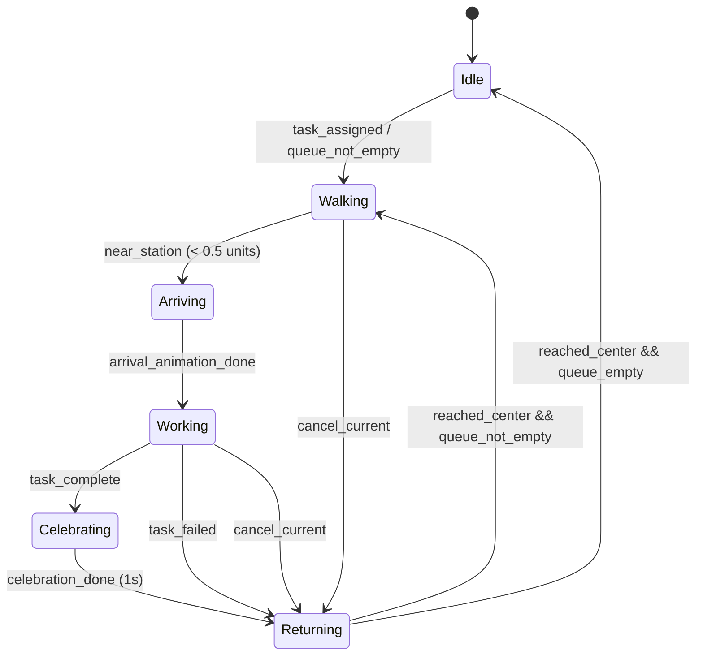
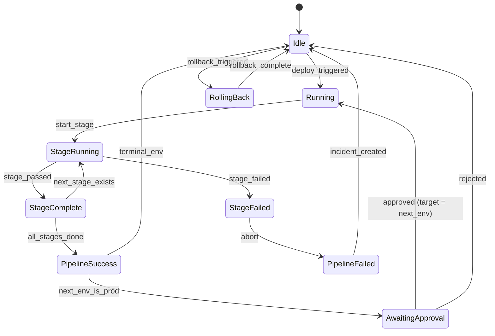

# Design Document: Phase 3 Demos Upgrade

## Overview

This design upgrades three interactive portfolio demos from toy simulations into production-grade engineering showcases that demonstrate CTO-level systems thinking. Each demo is a self-contained, client-side application running within the existing Next.js portfolio — no backend APIs needed, fully static-deployable.

**Key Design Decisions:**
- All demos are client-rendered (`"use client"`) and dynamically imported with `next/dynamic` for code splitting and sub-3-second initial load
- Canvas/WebGL for graphics-intensive rendering (IoT breadboard via SVG + Canvas hybrid, AI 3D scene via React Three Fiber)
- Deterministic state machines with event-sourced simulation cores — enabling replay, undo, and testability
- Existing dependencies leveraged: Three.js, React Three Fiber/Drei, Framer Motion, GSAP
- New dev dependency: `fast-check` for property-based testing of pure logic modules
- IoT simulation uses a **realistic nodal analysis model** with Ohm's Law, voltage dividers, and current limiting — not a toy "connectivity-only" approach

**Architecture Principle:** Each demo is a standalone module under `src/components/demos/{demo}/` with its own internal architecture following a strict **Engine/Renderer separation** pattern. Pure TypeScript engines handle all logic (testable without DOM). React components are thin rendering shells that subscribe to engine state via hooks. They share only UI primitives from `src/components/ui/` and the existing layout system.

---

## Architecture

### High-Level System Diagram

```mermaid
graph TB
    subgraph "Next.js App Router"
        DemosPage["demos/page.tsx<br/>(Tab Controller + dynamic import)"]
    end

    subgraph "Demo 1: IoT Circuit Lab"
        IOT_Main["IoTCircuitLab.tsx"]
        IOT_Canvas["CircuitCanvas.tsx<br/>(SVG + Canvas hybrid)"]
        IOT_MNA["NodalAnalysis.ts<br/>(MNA Matrix Solver)"]
        IOT_Engine["SimulationEngine.ts<br/>(Tick Loop + ESP32 Runtime)"]
        IOT_Code["ArduinoCodeGenerator.ts<br/>(Code + ExecutionPlan)"]
        IOT_Models["ComponentModels.ts<br/>(Electrical Models)"]
        IOT_Validation["CircuitValidator.ts<br/>(Error Detection)"]
        IOT_Main --> IOT_Canvas
        IOT_Main --> IOT_Engine
        IOT_Engine --> IOT_MNA
        IOT_Engine --> IOT_Models
        IOT_Main --> IOT_Code
        IOT_Main --> IOT_Validation
    end

    subgraph "Demo 2: AI Task Agent"
        AI_Main["AITaskAgent.tsx"]
        AI_Scene["AgentScene.tsx<br/>(R3F Canvas + Post-processing)"]
        AI_FSM["AgentFSM.ts<br/>(Event-Sourced FSM)"]
        AI_Queue["TaskQueue.ts<br/>(Priority Queue)"]
        AI_Anim["ProceduralAnimator.ts<br/>(IK + Bone Manipulation)"]
        AI_Stations["TaskStations.tsx<br/>(7 Stations, Semicircle)"]
        AI_Main --> AI_Scene
        AI_Scene --> AI_Anim
        AI_Scene --> AI_Stations
        AI_Main --> AI_FSM
        AI_Main --> AI_Queue
    end

    subgraph "Demo 3: DevOps Command Center"
        CICD_Main["DevOpsCommandCenter.tsx"]
        CICD_DORA["DORAMetrics.tsx<br/>(4 Cards + Sparklines)"]
        CICD_Pipeline["EnvironmentFlow.tsx<br/>(Dev → Stage → Prod)"]
        CICD_Topology["InfraTopology.tsx<br/>(Force-Directed Canvas)"]
        CICD_Incidents["IncidentTimeline.tsx"]
        CICD_Engine["DeploymentEngine.ts<br/>(Event-Sourced State Machine)"]
        CICD_Metrics["MetricsCalculator.ts<br/>(DORA Computation)"]
        CICD_Topo["TopologyEngine.ts<br/>(Health Propagation)"]
        CICD_Main --> CICD_DORA
        CICD_Main --> CICD_Pipeline
        CICD_Main --> CICD_Topology
        CICD_Main --> CICD_Incidents
        CICD_Main --> CICD_Engine
        CICD_Engine --> CICD_Metrics
        CICD_Engine --> CICD_Topo
    end

    DemosPage --> IOT_Main
    DemosPage --> AI_Main
    DemosPage --> CICD_Main
```



### Shared Patterns Across All Demos

1. **State Machine Pattern**: Each demo has a core engine (pure TypeScript, no React) that manages simulation state. React components subscribe to state changes via hooks.
2. **Separation of Concerns**: Rendering (React/Canvas/WebGL) is decoupled from logic (pure TS modules). This enables property-based testing of logic without DOM dependencies.
3. **Lazy Loading**: Each demo is `dynamic(() => import(...), { ssr: false })` to keep initial page load fast.
4. **Accessibility**: All interactive elements have `aria-label`, keyboard handlers, and respect `prefers-reduced-motion`.

---

## Components and Interfaces

### Demo 1: IoT Circuit Lab

#### File Structure
```
src/components/demos/iot/
├── IoTCircuitLab.tsx              # Main container — 3-panel layout
├── canvas/
│   ├── CircuitCanvas.tsx          # SVG + Canvas hybrid renderer
│   ├── BreadboardSVG.tsx          # SVG breadboard with realistic hole grid (830 tie points)
│   ├── ComponentSVG.tsx           # SVG component visuals (IC packages, axial resistors, etc.)
│   ├── WireRenderer.tsx           # Bezier curve wires with animated current particles
│   └── CurrentFlowOverlay.tsx     # Canvas overlay: animated electron dots along wire paths
├── engine/
│   ├── SimulationEngine.ts        # Nodal analysis solver (pure)
│   ├── CircuitValidator.ts        # Error detection: shorts, overloads, floating (pure)
│   ├── CircuitGraph.ts            # Netlist / adjacency representation (pure)
│   ├── NodalAnalysis.ts           # Modified Nodal Analysis (MNA) matrix solver (pure)
│   └── ComponentModels.ts         # Electrical models per component type (pure)
├── codegen/
│   ├── ArduinoCodeGenerator.ts    # Generates Arduino C++ from circuit (pure)
│   └── CodeTemplates.ts           # Per-component code snippets
├── data/
│   ├── ComponentLibrary.ts        # Full component specs with electrical params
│   ├── ProjectTemplates.ts        # 5 predefined circuits
│   └── ESP32Pinout.ts             # Complete ESP32-DevKit-C pinout data (38 pins)
├── panels/
│   ├── ComponentDrawer.tsx        # Categorized drag source with search
│   ├── CodePanel.tsx              # Syntax-highlighted Arduino code (Prism.js inline)
│   ├── SerialMonitor.tsx          # Terminal-style output with timestamps
│   ├── PinDiagram.tsx             # Interactive GPIO reference overlay
│   └── PropertyInspector.tsx      # Selected component property editor
├── hooks/
│   ├── useCircuitState.ts         # Zustand-like state hook for circuit
│   ├── useDragAndDrop.ts          # Pointer event handling for component placement
│   └── useSimulation.ts           # requestAnimationFrame loop driving engine
└── types.ts                       # Shared TypeScript interfaces
```

#### Core Interfaces

```typescript
// types.ts

/** Represents a physical component placed on the breadboard */
interface CircuitComponent {
  id: string;
  type: ComponentType;
  position: { row: number; col: number };    // breadboard grid coords (0-based)
  orientation: 0 | 90 | 180 | 270;          // rotation in degrees
  pins: Pin[];
  electricalParams: ElectricalParams;        // resistance, forward voltage, etc.
  state: ComponentState;                      // runtime computed state
}

type ComponentType =
  | "esp32" | "led_red" | "led_green" | "led_blue" | "led_yellow" | "led_white"
  | "resistor_220" | "resistor_1k" | "resistor_10k" | "resistor_custom"
  | "dht22" | "button_momentary" | "buzzer_active" | "buzzer_passive"
  | "oled_128x64" | "servo_sg90" | "relay_5v" | "ldr" | "potentiometer"
  | "capacitor" | "diode" | "transistor_npn";

/** Electrical parameters vary by component type */
type ElectricalParams =
  | { kind: "resistor"; resistance: number }                     // Ohms
  | { kind: "led"; forwardVoltage: number; maxCurrent: number }  // V, mA
  | { kind: "sensor"; outputType: "analog" | "digital"; readInterval: number }
  | { kind: "actuator"; operatingVoltage: number; maxCurrent: number }
  | { kind: "mcu"; gpioVoltage: 3.3; maxPinCurrent: 40 }       // ESP32 specs
  | { kind: "passive"; capacitance?: number; inductance?: number };

interface Pin {
  id: string;
  label: string;                    // "GPIO2", "GND", "3V3", "D2"
  globalPosition: { x: number; y: number };  // absolute canvas coords (computed)
  localOffset: { dx: number; dy: number };   // relative to component anchor
  electricalType: "power_3v3" | "power_5v" | "ground" | "gpio_digital" | "gpio_analog" | "gpio_pwm" | "i2c_sda" | "i2c_scl" | "spi" | "uart" | "signal";
  direction: "input" | "output" | "bidirectional";
  maxCurrent: number;               // mA
  voltage: number;                  // computed by nodal analysis
  current: number;                  // computed — current flowing through this pin
}

interface Wire {
  id: string;
  from: { componentId: string; pinId: string };
  to: { componentId: string; pinId: string };
  netId: string;                    // which electrical net this wire belongs to
  path: { x: number; y: number }[]; // bezier control points for visual routing
  current: number;                  // computed — mA flowing through wire
  voltage: number;                  // computed — voltage at this net
}

interface CircuitState {
  components: CircuitComponent[];
  wires: Wire[];
  nets: Net[];                      // electrically connected groups of pins
  isRunning: boolean;
  simulationTick: number;
  errors: CircuitError[];
  warnings: CircuitWarning[];
  serialOutput: SerialMessage[];
  clockMs: number;                  // simulated ESP32 millis()
}

/** An electrical net is a set of pins that are all connected */
interface Net {
  id: string;
  pinRefs: { componentId: string; pinId: string }[];
  voltage: number;                  // solved voltage
  label?: string;                   // "VCC", "GND", "NET_3"
}

interface CircuitError {
  type: "short_circuit" | "missing_ground" | "floating_pin" | "overcurrent" | "reverse_polarity";
  severity: "error" | "warning";
  affectedComponents: string[];
  affectedNets: string[];
  message: string;
  suggestion: string;               // "Add a 220Ω resistor in series"
}

interface CircuitWarning {
  type: "high_current" | "voltage_drop" | "unused_gpio" | "pull_up_recommended";
  componentId: string;
  message: string;
}

interface SerialMessage {
  timestamp: number;                // simulated millis()
  content: string;
  type: "info" | "data" | "error";
}
```

#### Simulation Engine — Realistic Nodal Analysis

The simulation uses **Modified Nodal Analysis (MNA)**, the same technique used in real circuit simulators (LTspice, Falstad). This is implemented as a pure TypeScript module solving a linear system Ax = z:

```typescript
// engine/NodalAnalysis.ts

/**
 * Modified Nodal Analysis for DC steady-state circuits.
 * 
 * Approach:
 * 1. Identify all unique nets (electrically connected pin groups)
 * 2. Build conductance matrix G (from resistors, LED models, etc.)
 * 3. Build source vector I (from voltage/current sources — ESP32 GPIO outputs)
 * 4. Solve GV = I using Gaussian elimination (circuits are small enough: <50 nodes)
 * 5. Extract node voltages and branch currents
 * 
 * Simplifications for portfolio scope:
 * - DC only (no AC/frequency analysis, no capacitor transients)
 * - LEDs modeled as voltage drop + series resistance (piecewise linear)
 * - Sensors modeled as variable resistors or current sources
 * - ESP32 GPIO outputs modeled as ideal voltage sources (3.3V, 40mA max)
 */

interface MNAResult {
  nodeVoltages: Map<string, number>;     // netId → voltage
  branchCurrents: Map<string, number>;   // wireId → current in mA
  componentStates: Map<string, ComponentState>;
  valid: boolean;
  errors: string[];
}

function solveCircuit(nets: Net[], components: CircuitComponent[], wires: Wire[]): MNAResult {
  // 1. Assign node indices (GND = node 0, reference)
  // 2. Stamp conductance matrix for each component:
  //    - Resistor: G[i][i] += 1/R, G[j][j] += 1/R, G[i][j] -= 1/R, G[j][i] -= 1/R
  //    - LED: Piecewise linear model — if V > Vf, conduct with internal resistance
  //    - Voltage source (GPIO output): adds row/col to augmented matrix
  // 3. Gaussian elimination to solve
  // 4. Back-substitute to get all node voltages
  // 5. Compute branch currents: I = (V_a - V_b) / R
}
```

**Component Electrical Models:**

```typescript
// engine/ComponentModels.ts

/** Each component type has a stamp function that contributes to the MNA matrix */
interface ComponentModel {
  type: ComponentType;
  stamp(matrix: number[][], rhs: number[], nodeMap: Map<string, number>, component: CircuitComponent): void;
  computeState(voltages: Map<string, number>, component: CircuitComponent): ComponentState;
}

// LED Model: piecewise linear
// If V_anode - V_cathode > Vf → conducting, internal R ≈ 20Ω
// LED brightness = clamp((I - 2mA) / (maxI - 2mA), 0, 1)

// Resistor Model: pure conductance stamp
// DHT22 Model: high impedance input (pulls negligible current), outputs digital data
// Button Model: open = infinite resistance, closed = 0.1Ω
// Buzzer Model: if V > threshold, active; frequency prop to voltage for passive
// Servo Model: PWM signal interpreted, position = map(dutyCycle, 0, 100, 0, 180)
// LDR Model: resistance varies with "ambient light" slider (1kΩ dark → 100kΩ light)
// Potentiometer: voltage divider, user-adjustable ratio
```

**Simulation Loop:**

```typescript
// engine/SimulationEngine.ts
interface SimulationStep {
  tick: number;
  circuitState: CircuitState;
  serialOutput: SerialMessage[];
  executionContext: ESP32ExecutionContext; // simulated firmware state
}

/**
 * Runs one simulation tick (every 50ms = 20Hz update rate):
 * 1. Update dynamic component states (button press, potentiometer position, LDR ambient)
 * 2. Execute one iteration of the simulated Arduino loop()
 * 3. Re-solve MNA with updated source values (GPIO outputs may change)
 * 4. Compute LED brightness, servo position, buzzer state from solved voltages/currents
 * 5. Generate serial output from simulated Serial.println() calls
 * 6. Validate constraints (overcurrent protection, thermal limits)
 */
function simulateTick(prev: SimulationStep, userInputs: UserInputState): SimulationStep
```

**ESP32 Firmware Simulation:**

The code generator doesn't just produce code for display — the simulation actually *interprets* a simplified subset of the generated Arduino code at runtime:

```typescript
// engine/ESP32Runtime.ts

/**
 * Minimal Arduino runtime interpreter.
 * Executes the generated code's logic without a real compiler.
 * Supports: pinMode, digitalWrite, digitalRead, analogRead, analogWrite,
 *           Serial.println, delay (simulated), millis(), map()
 * 
 * Implementation: The code generator produces both displayable C++ AND
 * a parallel "execution plan" — an array of operations the simulator
 * can step through deterministically.
 */
interface ExecutionPlan {
  setupOps: Operation[];
  loopOps: Operation[];
}

type Operation =
  | { type: "pin_mode"; pin: number; mode: "INPUT" | "OUTPUT" | "INPUT_PULLUP" }
  | { type: "digital_write"; pin: number; value: "HIGH" | "LOW" }
  | { type: "digital_read"; pin: number; resultVar: string }
  | { type: "analog_read"; pin: number; resultVar: string }
  | { type: "analog_write"; pin: number; value: number }  // PWM 0-255
  | { type: "serial_print"; message: string; newline: boolean }
  | { type: "delay"; ms: number }
  | { type: "conditional"; condition: string; thenOps: Operation[]; elseOps: Operation[] }
  | { type: "loop_control"; kind: "continue" | "break" };
```

#### Code Generation Design

`ArduinoCodeGenerator` produces idiomatic Arduino/ESP32 code with:
- Proper `#include` directives based on components used (e.g., `#include <DHT.h>`, `#include <Servo.h>`, `#include <Wire.h>` for I2C OLED)
- Correct pin definitions using ESP32 GPIO numbers
- `setup()` with pin modes, Serial.begin(115200), library initialization
- `loop()` with sensor reads, conditional logic, actuator control
- Proper debouncing for buttons
- Non-blocking delay patterns using `millis()` instead of `delay()`
- Comments explaining each section

The generator also outputs the parallel `ExecutionPlan` for the runtime interpreter.

#### Breadboard Rendering — SVG + Canvas Hybrid

- **SVG layer**: Static breadboard structure (holes, rails, component outlines) — crisp at any zoom, semantically selectable
- **Canvas overlay**: Animated current flow particles (dots moving along wire paths at speed proportional to current), real-time LED glow effects, oscilloscope-style waveforms in the serial monitor
- **Interaction**: Pointer events on SVG elements for drag-and-drop, wire creation via click-click (start pin → end pin), zoom/pan via wheel/pinch

---

### Demo 2: AI Task Agent

#### File Structure
```
src/components/demos/ai/
├── AITaskAgent.tsx                # Main container — split view (3D + panels)
├── scene/
│   ├── AgentScene.tsx             # R3F Canvas: lighting, shadows, environment map
│   ├── Character.tsx              # GLB loader + animation mixer/procedural controller
│   ├── WorkspaceGround.tsx        # Grid-textured ground with subtle reflections
│   ├── TaskStations.tsx           # 3D station meshes with labels (7 stations in semicircle)
│   ├── PathVisualizer.tsx         # Dashed line showing planned movement path
│   ├── ParticleEffect.tsx         # GPU particle burst on task completion
│   └── MiniMap.tsx                # Overhead 2D view of agent position
├── logic/
│   ├── TaskQueue.ts               # Priority queue with FIFO fallback (pure)
│   ├── AgentFSM.ts                # Event-sourced finite state machine (pure)
│   ├── PathPlanner.ts             # A* pathfinding between stations (pure)
│   ├── TaskDefinitions.ts         # Task metadata with dependencies (pure data)
│   └── StatsCalculator.ts         # Running statistics computation (pure)
├── animation/
│   ├── ProceduralAnimator.ts      # IK-based procedural animation system
│   ├── AnimationBlender.ts        # Crossfade between animation states
│   └── BoneMapping.ts             # Maps generic bone names to GLB skeleton
├── panels/
│   ├── TaskQueuePanel.tsx         # Drag-reorderable task list with priority
│   ├── LogPanel.tsx               # Virtualized real-time log (handles 1000+ entries)
│   ├── StatsPanel.tsx             # Animated counters, throughput chart
│   └── AgentStatusBadge.tsx       # Current state indicator with timer
└── types.ts
```

#### Core Interfaces

```typescript
// types.ts

interface Task {
  id: string;
  name: string;
  category: "infrastructure" | "testing" | "data" | "frontend" | "ml" | "maintenance";
  duration: number;                  // seconds (3-15)
  stationId: string;
  priority: "low" | "normal" | "high" | "critical";
  status: "queued" | "in-progress" | "completed" | "failed";
  progress: number;                  // 0-1
  startedAt?: number;
  completedAt?: number;
  subtasks?: string[];               // display-only breakdown of what the task "does"
  icon: string;                      // emoji for visual identification
}

interface TaskStation {
  id: string;
  name: string;
  position: [number, number, number];  // 3D world position (arranged in semicircle)
  type: "server_rack" | "terminal" | "database" | "monitor_wall" | "workbench" | "ml_cluster" | "war_room";
  modelHint: string;                   // geometry description for procedural mesh
  glowColor: string;                   // station accent color
  taskCategories: string[];            // which task categories run here
}

type AgentState = "idle" | "walking" | "arriving" | "working" | "celebrating" | "returning";

interface AgentFSMContext {
  state: AgentState;
  currentTask: Task | null;
  position: [number, number, number];
  targetPosition: [number, number, number];
  path: [number, number, number][];    // waypoints from path planner
  pathProgress: number;                // 0-1 along current path segment
  queue: Task[];
  completedTasks: Task[];
  failedTasks: Task[];
  logs: LogEntry[];
  stats: AgentStats;
  stateEnteredAt: number;              // timestamp for state duration tracking
}

interface AgentStats {
  totalCompleted: number;
  totalFailed: number;
  averageDuration: number;
  totalWorkTime: number;
  totalWalkTime: number;
  throughputPerMinute: number;        // rolling 60s window
  currentStreak: number;              // consecutive successes
  efficiency: number;                 // workTime / (workTime + walkTime + idleTime)
}

interface LogEntry {
  id: string;
  timestamp: number;
  message: string;
  type: "info" | "success" | "warning" | "error" | "state-change";
  taskId?: string;
}

type AgentEvent =
  | { type: "task_assigned"; task: Task }
  | { type: "tick"; deltaTime: number }
  | { type: "reached_station" }
  | { type: "task_progress"; progress: number }
  | { type: "task_complete" }
  | { type: "task_failed"; reason: string }
  | { type: "reached_center" }
  | { type: "queue_reordered"; newOrder: string[] }
  | { type: "cancel_current" };
```

#### Agent Finite State Machine — Event-Sourced



The FSM is event-sourced — every transition is logged with timestamp, enabling full replay and stats computation:

```typescript
// logic/AgentFSM.ts

interface FSMTransitionResult {
  nextContext: AgentFSMContext;
  sideEffects: SideEffect[];          // logs to append, stats to update, particles to trigger
}

type SideEffect =
  | { type: "log"; entry: LogEntry }
  | { type: "particle_burst"; position: [number, number, number]; color: string }
  | { type: "sound_hint"; sound: "complete" | "failed" | "start" }
  | { type: "stats_update"; delta: Partial<AgentStats> };

function transition(ctx: AgentFSMContext, event: AgentEvent): FSMTransitionResult {
  // Pure function — no side effects, returns new context + effect descriptors
  // All randomness (task failure chance: 5%) is seeded for reproducibility
}
```

#### Path Planning

Stations are arranged in a semicircle. The agent navigates using simple waypoints:

```typescript
// logic/PathPlanner.ts

/**
 * Plans a path from current position to target station.
 * Uses a simple hub-and-spoke model:
 * - Agent always returns to center (0, 0, 0) first
 * - Then walks outward to target station
 * - This creates natural-looking movement without complex navmesh
 * 
 * Returns an array of waypoints for smooth interpolation.
 * Walking speed: 2.5 units/second with ease-in-out.
 */
function planPath(from: [number, number, number], to: [number, number, number]): [number, number, number][]
```

#### Character Animation — Procedural IK System

Since `mainCharacter.glb` may have limited or no embedded animations:

```typescript
// animation/ProceduralAnimator.ts

/**
 * Procedural animation system that manipulates bones directly:
 * 
 * IDLE:
 * - Chest/spine: subtle breathing oscillation (sin wave, ±2° rotation X, 0.8Hz)
 * - Arms: slight sway (±3° rotation Z, 0.4Hz, phase offset)
 * - Head: micro-movement looking around (random target, lerp to it over 2s)
 * - Weight shift: hips offset ±0.02 on X axis every 4s
 * 
 * WALKING:
 * - Legs: IK-driven step cycle (raise foot, move forward, plant)
 * - Arms: counter-swing to legs (pendulum, 180° phase offset)
 * - Torso: slight lean into walk direction
 * - Bob: sine wave Y displacement, peak at mid-stride
 * - Speed: synchronized to actual movement velocity
 * 
 * WORKING:
 * - Upper body: typing gesture (hands alternate forward position)
 * - Head: focused downward (15° pitch)
 * - Periodic "reach" gesture (one hand extends further)
 * - Body: minimal movement, concentrated pose
 * 
 * CELEBRATING:
 * - Arms: raise above head (lerp up over 0.5s)
 * - Slight jump (Y +0.3 over 0.3s, ease-out)
 * - Return to normal over 0.5s
 */
```

#### 3D Scene Composition

```typescript
// Scene setup:
// - Environment: HDR environment map for realistic reflections (drei's Environment)
// - Lighting: Directional light (sun) + ambient + 7 point lights at stations
// - Ground: 20x20 unit grid, subtle metallic material with grid lines
// - Stations: Arranged in semicircle at radius 6 units, 7 stations at 25.7° intervals
// - Camera: PerspectiveCamera at [8, 6, 8] looking at center, OrbitControls enabled
// - Post-processing: SSAO + bloom (subtle, for station glow effects)
// - Shadows: Soft shadows from directional light, shadow map 1024x1024
```

---

### Demo 3: DevOps Command Center

#### File Structure
```
src/components/demos/cicd/
├── DevOpsCommandCenter.tsx        # Main layout — command center aesthetic
├── metrics/
│   ├── DORAMetrics.tsx            # 4 DORA cards with animated counters
│   ├── Sparkline.tsx              # Canvas-rendered mini line chart with gradient
│   ├── MetricRating.ts            # Classification logic against DORA benchmarks (pure)
│   └── TrendIndicator.tsx         # Up/down/stable arrow with delta percentage
├── pipeline/
│   ├── EnvironmentFlow.tsx        # 3-column responsive layout (Dev | Stage | Prod)
│   ├── PipelineStages.tsx         # Animated stage progression with duration timers
│   ├── ApprovalGate.tsx           # Modal with reviewer info, diff summary, approve/reject
│   ├── RollbackFlow.tsx           # Animated revert with version comparison
│   └── BuildLogs.tsx              # ANSI-colored terminal output (retained from current)
├── topology/
│   ├── InfraTopology.tsx          # Force-directed graph (Canvas) with physics simulation
│   ├── ServiceNode.tsx            # Node with health ring, request count, latency
│   └── DependencyEdge.tsx         # Animated data flow on edges with throughput label
├── incidents/
│   ├── IncidentTimeline.tsx       # Vertical timeline with severity markers
│   ├── IncidentCard.tsx           # Expandable card with MTTR timer, status, action history
│   └── IncidentEngine.ts          # Auto-creates/resolves incidents (pure)
├── history/
│   ├── DeploymentHistory.tsx      # Sortable/filterable table with virtual scroll
│   ├── VelocityChart.tsx          # Stacked bar chart (Canvas) — 14 day window
│   └── CommitFeed.tsx             # Git-log-style commit list
├── engine/
│   ├── DeploymentEngine.ts        # Pipeline state machine with event sourcing (pure)
│   ├── MetricsCalculator.ts       # DORA computation from event log (pure)
│   ├── TopologyEngine.ts          # Service health derivation rules (pure)
│   ├── SimulationData.ts          # Realistic fake data generators (commit hashes, authors)
│   └── ScenarioRunner.ts          # Pre-scripted demo scenarios for auto-play mode
├── hooks/
│   ├── useDeploymentState.ts      # Central state management hook
│   └── useAutoSimulation.ts       # Optional auto-play that runs through a demo scenario
└── types.ts
```

#### Core Interfaces

```typescript
// types.ts
type Environment = "development" | "staging" | "production";
type PipelineStatus = "idle" | "queued" | "running" | "success" | "failed" | "rolled-back" | "cancelled";
type PipelineStage = "checkout" | "install" | "lint" | "test" | "build" | "deploy" | "healthcheck";
type PerformanceRating = "elite" | "high" | "medium" | "low";

interface DORAMetrics {
  deploymentFrequency: MetricData;
  leadTime: MetricData;
  changeFailureRate: MetricData;
  mttr: MetricData;
}

interface MetricData {
  value: number;
  unit: string;
  history: number[];               // last 8 data points for sparkline
  rating: PerformanceRating;
  trend: "improving" | "stable" | "degrading";
  delta: number;                   // % change from previous period
}

interface Deployment {
  id: string;
  commitHash: string;              // 7-char hex
  author: string;
  avatarSeed: string;              // for deterministic avatar generation
  message: string;                 // realistic commit messages
  environment: Environment;
  stages: StageResult[];
  overallStatus: PipelineStatus;
  startedAt: number;
  completedAt: number | null;
  duration: number;                // ms
  version: string;                 // semver
  triggeredBy: "manual" | "push" | "promotion" | "rollback";
  approvedBy?: string;             // for prod deployments
}

interface StageResult {
  stage: PipelineStage;
  status: PipelineStatus;
  startedAt: number;
  completedAt: number | null;
  duration: number;                // ms
  logs: string[];                  // ANSI-colored log lines
  artifactSize?: number;           // bytes, for build stage
}

interface ServiceNode {
  id: string;
  name: string;
  type: "frontend" | "api" | "database" | "cache" | "queue" | "worker" | "cdn" | "auth";
  health: "healthy" | "degraded" | "down" | "maintenance";
  metrics: {
    requestsPerSec: number;
    latencyP50: number;            // ms
    latencyP99: number;            // ms
    errorRate: number;             // percentage
    cpuUsage: number;              // percentage
    memoryUsage: number;           // percentage
  };
  position: { x: number; y: number };  // force-directed layout computed
  dependsOn: string[];
  lastDeployed: string;            // version
}

interface Incident {
  id: string;
  title: string;
  deploymentId: string;
  environment: Environment;
  detectedAt: number;
  acknowledgedAt: number | null;
  respondedAt: number | null;
  resolvedAt: number | null;
  severity: "critical" | "major" | "minor";
  status: "detected" | "acknowledged" | "investigating" | "mitigating" | "resolved";
  timeline: IncidentEvent[];
  affectedServices: string[];
  rootCause?: string;
}

interface IncidentEvent {
  timestamp: number;
  description: string;
  actor: string;                   // "system" | person name
  type: "detection" | "notification" | "action" | "resolution";
}

interface DeploymentEngineState {
  environments: Record<Environment, EnvironmentState>;
  deployments: Deployment[];       // last 100
  incidents: Incident[];
  metrics: DORAMetrics;
  velocityData: number[];          // deploys per day, last 14 days
  serviceTopology: ServiceNode[];
  eventLog: EngineEvent[];         // full event source for replay
  autoPlayActive: boolean;
}

interface EnvironmentState {
  currentVersion: string;
  previousVersion: string;
  status: PipelineStatus;
  currentStage: number;            // -1 if idle
  lastDeployedAt: number;
  deployCount: number;
  pendingApproval: boolean;
  lockedBy?: string;               // who approved/locked promotion
}
```

#### Deployment Engine — Event-Sourced State Machine



The engine is fully event-sourced — the current state is a pure fold over the event log:

```typescript
// engine/DeploymentEngine.ts

type EngineEvent =
  | { type: "DEPLOY_TRIGGERED"; environment: Environment; commit: CommitInfo; timestamp: number }
  | { type: "STAGE_STARTED"; stage: PipelineStage; timestamp: number }
  | { type: "STAGE_COMPLETED"; stage: PipelineStage; duration: number; timestamp: number }
  | { type: "STAGE_FAILED"; stage: PipelineStage; error: string; timestamp: number }
  | { type: "PIPELINE_SUCCESS"; environment: Environment; version: string; timestamp: number }
  | { type: "PIPELINE_FAILED"; environment: Environment; stage: PipelineStage; timestamp: number }
  | { type: "PROMOTION_REQUESTED"; from: Environment; to: Environment; timestamp: number }
  | { type: "PROMOTION_APPROVED"; approver: string; timestamp: number }
  | { type: "PROMOTION_REJECTED"; reason: string; timestamp: number }
  | { type: "ROLLBACK_TRIGGERED"; environment: Environment; targetVersion: string; timestamp: number }
  | { type: "ROLLBACK_COMPLETED"; environment: Environment; timestamp: number }
  | { type: "INCIDENT_CREATED"; incident: Incident; timestamp: number }
  | { type: "INCIDENT_UPDATED"; incidentId: string; status: Incident["status"]; timestamp: number }
  | { type: "SERVICE_HEALTH_CHANGED"; serviceId: string; health: ServiceNode["health"]; timestamp: number };

/**
 * Pure reducer: folds events into state.
 * This enables: undo, replay, time-travel debugging, and deterministic testing.
 */
function reduce(state: DeploymentEngineState, event: EngineEvent): DeploymentEngineState

/**
 * Command handler: validates and emits events.
 * Enforces business rules (can't promote without approval, can't deploy while running, etc.)
 */
function dispatch(state: DeploymentEngineState, command: Command): EngineEvent[]
```

#### DORA Metrics — Real Industry Benchmarks

Based on the DORA State of DevOps Report classifications:

```typescript
// engine/MetricsCalculator.ts

/**
 * Computes all 4 DORA metrics from the deployment event log.
 * Uses rolling windows matching industry standard measurement periods.
 */

// Deployment Frequency: successful deploys to production per week
// Lead Time for Changes: median time from commit to production deploy (simulated)
// Change Failure Rate: % of production deploys that trigger an incident
// MTTR: median time from incident detection to resolution

const DORA_THRESHOLDS = {
  deploymentFrequency: { elite: 7, high: 3, medium: 1, low: 0 },      // per week
  leadTime:            { elite: 60, high: 1440, medium: 10080, low: Infinity },  // minutes
  changeFailureRate:   { elite: 5, high: 10, medium: 15, low: 100 },   // percent
  mttr:                { elite: 60, high: 1440, medium: 10080, low: Infinity },  // minutes
} as const;

function computeDORA(events: EngineEvent[], now: number): DORAMetrics
function classifyMetric(value: number, thresholds: { elite: number; high: number; medium: number; low: number }): PerformanceRating
function computeTrend(history: number[]): "improving" | "stable" | "degrading"
```

#### Infrastructure Topology — Force-Directed Graph

The topology uses a Canvas-based force-directed layout with:
- **Nodes**: Circles with health-ring (green/yellow/red stroke), icon center, request count label
- **Edges**: Curved lines with animated dots showing data flow direction
- **Physics**: Spring-based simulation for natural node positioning (settles in ~1 second)
- **Interaction**: Hover to see metrics tooltip, click to highlight dependency chain
- **Health propagation**: When an API service goes down, downstream services show "degraded"

```typescript
// topology/TopologyEngine.ts

/**
 * Derives service health from deployment outcomes:
 * - Service has "healthy" if latest deploy to its environment succeeded
 * - Service degrades to "degraded" if a dependent service is down
 * - Service goes "down" if its own deploy failed
 * - Propagation: health degrades flow downstream through dependency edges
 */
function computeServiceHealth(
  topology: ServiceNode[],
  deployments: Deployment[],
  incidents: Incident[]
): ServiceNode[]
```

#### Auto-Play Demo Scenario

For visitors who just want to watch, an auto-play mode runs a scripted scenario:
1. Deploy to dev (succeeds in 8s)
2. Promote to staging (succeeds in 10s)
3. Request production approval (waits 3s, auto-approves)
4. Deploy to production (fails at healthcheck stage)
5. Incident auto-created, MTTR timer starts
6. Auto-rollback after 5s
7. Incident resolved, metrics update

This showcases the full flow without user interaction.

---

## Data Models

### IoT Circuit Lab — Netlist and Circuit Graph

The circuit uses a **netlist representation** — the standard format used in EDA tools. Each net is a group of electrically connected pins:

```typescript
interface Netlist {
  nets: Net[];                        // all electrical nets
  components: CircuitComponent[];     // all placed components
  groundNet: string;                  // reference net ID (0V)
  powerNet: string;                   // VCC net ID (3.3V from ESP32)
}

interface CircuitGraph {
  nodes: Map<string, GraphNode>;      // netId → node data
  adjacency: Map<string, Set<string>>; // netId → connected netIds (through components)
  componentMap: Map<string, { from: string; to: string; model: ComponentModel }>; // component → nets it bridges
}

interface GraphNode {
  netId: string;
  connectedPins: { componentId: string; pinId: string }[];
  voltage: number;                    // solved by MNA
  isReference: boolean;               // true for GND net
}
```

The MNA solver builds a matrix of size N×N where N = number of nets (excluding ground reference). For typical portfolio circuits (5-10 components), this is a 10-20 node matrix — trivially solvable in <1ms.

### AI Task Agent — Event-Sourced State

The agent's full state is reconstructable from its event log:

```typescript
interface AgentEventLog {
  events: AgentEvent[];               // complete history
  snapshots: Map<number, AgentFSMContext>; // periodic snapshots for fast seek
}

interface TaskQueueState {
  pending: Task[];                    // priority-sorted
  current: Task | null;
  completed: Task[];
  failed: Task[];
  stats: AgentStats;
}
```

Priority ordering: `critical > high > normal > low`, with FIFO within same priority level.

### DevOps Command Center — Event Store

The deployment engine is fully event-sourced. Current state = `events.reduce(reducer, initialState)`:

```typescript
interface EventStore {
  events: EngineEvent[];              // append-only log (last 500 events)
  currentState: DeploymentEngineState; // cached projection
  snapshotAt: number;                 // event index of last snapshot
}

// Computed views (derived from event store):
interface ComputedViews {
  metrics: DORAMetrics;               // recomputed on each new event
  velocityChart: number[];            // deploys/day for 14 days
  topologyHealth: ServiceNode[];      // health propagated through graph
  activeIncidents: Incident[];        // incidents not yet resolved
}
```

This event-sourcing approach enables:
- **Time-travel debugging**: Replay to any point in deployment history
- **Deterministic testing**: Feed fixed event sequences, assert state
- **Auto-play mode**: Pre-recorded event sequences drive the demo
- **Undo**: Remove last event and recompute

---


## Correctness Properties

*A property is a characteristic or behavior that should hold true across all valid executions of a system — essentially, a formal statement about what the system should do. Properties serve as the bridge between human-readable specifications and machine-verifiable correctness guarantees.*

### Property 1: Wire Creation Produces Graph Edge

*For any* two valid pins on different components, creating a wire between them SHALL produce a corresponding edge in the circuit graph connecting those two pin nodes.

**Validates: Requirements IOT-3**

### Property 2: Nodal Analysis Solves Correctly (Ohm's Law Invariant)

*For any* circuit with a resistor of resistance R connected between two nets with solved voltages V1 and V2, the current through that resistor SHALL equal (V1 - V2) / R (Ohm's Law). Additionally, for any component with a complete power path, the solved node voltages SHALL produce a non-zero current through the component, setting it to active.

**Validates: Requirements IOT-4**

### Property 3: Code Generator References Correct Pins

*For any* valid circuit configuration with at least one connected component, the Arduino code generator SHALL produce output that contains `pinMode` declarations for all GPIO pins used in connections, a `setup()` function, and a `loop()` function.

**Validates: Requirements IOT-6**

### Property 4: Circuit Validator Detects Errors Without False Positives

*For any* circuit containing a direct VCC-to-GND connection (short circuit), the validator SHALL report a "short" error. *For any* circuit where a component has no ground path, the validator SHALL report a "missing_ground" error. *For any* valid circuit (complete power paths, no shorts), the validator SHALL report zero errors.

**Validates: Requirements IOT-9, IOT-5**

### Property 5: Task Queue Addition Invariant

*For any* task queue state and any valid task from the predefined list, adding the task SHALL increase the queue's pending length by exactly 1, and the added task SHALL appear at the tail of the pending list.

**Validates: Requirements AI-3**

### Property 6: Agent FSM Lifecycle Correctness

*For any* task assigned to the agent, the FSM SHALL transition through states in the sequence: idle → walking → working → returning → (idle | walking). If the queue is non-empty upon task completion, the FSM SHALL transition from returning directly to walking (next task). If the queue is empty, it SHALL transition to idle.

**Validates: Requirements AI-5, AI-6**

### Property 7: FSM Transitions Produce Log Entries

*For any* state transition in the agent FSM, a corresponding log entry SHALL be appended to the log with a message describing the transition and a timestamp equal to or greater than the previous log entry's timestamp.

**Validates: Requirements AI-8**

### Property 8: Task Statistics Correctness

*For any* non-empty set of completed tasks, the computed average duration SHALL equal the sum of all task durations divided by the number of completed tasks, and totalCompleted SHALL equal the length of the completed tasks array.

**Validates: Requirements AI-9**

### Property 9: DORA Metrics Computed From Deployment History

*For any* set of deployments with timestamps, the deployment frequency SHALL equal the count of successful deployments in the measurement window divided by the window duration. The velocity chart daily counts SHALL equal the number of deployments for each respective day.

**Validates: Requirements CICD-1, CICD-10**

### Property 10: DORA Rating Classification

*For any* deployment frequency value ≥ 7/week, the rating SHALL be "elite". *For any* lead time ≤ 1 hour, the rating SHALL be "elite". *For any* change failure rate ≤ 5%, the rating SHALL be "elite". *For any* MTTR ≤ 60 minutes, the rating SHALL be "elite". The same monotonic relationship holds for all rating boundaries (high, medium, low).

**Validates: Requirements CICD-2**

### Property 11: Environment Promotion Respects Ordering and Gates

*For any* deployment, promotion SHALL only target the next sequential environment (dev → staging → production, never dev → production). *For any* promotion to production, it SHALL be blocked unless an explicit approval event has been received.

**Validates: Requirements CICD-3, CICD-4**

### Property 12: Rollback Restores Previous Version

*For any* environment that has at least two deployments in its history, triggering a rollback SHALL set the current version to the previous version, and the environment status SHALL be "rolled-back".

**Validates: Requirements CICD-5**

### Property 13: Service Health Reflects Pipeline Outcomes

*For any* service node in the topology, if the most recent deployment to that service succeeded, its health SHALL be "healthy". If the deployment failed, its health SHALL be "degraded" or "down".

**Validates: Requirements CICD-7**

### Property 14: Failed Deployment Creates Incident

*For any* deployment that results in a "failed" status, the system SHALL create an incident record with `detectedAt` set to the failure timestamp, `deploymentId` referencing the failed deployment, and severity based on the environment (production failures = "critical").

**Validates: Requirements CICD-8**

### Property 15: Pipeline Stages Execute in Order

*For any* pipeline execution, stages SHALL execute in the exact sequence: checkout → install → lint → test → build → deploy → healthcheck. No stage SHALL begin before the previous stage completes successfully.

**Validates: Requirements CICD-11**

---

## Error Handling

### IoT Circuit Lab

| Error Condition | Handling Strategy |
|---|---|
| User creates a short circuit | `CircuitValidator` detects it before simulation runs. Warning overlay on canvas with affected wires highlighted in red. Simulation blocked until resolved. |
| User connects incompatible pins (e.g., two outputs) | Validator flags "conflicting outputs" error. Wire shown with warning color. |
| Component placed outside breadboard bounds | Snap-to-grid logic prevents out-of-bounds placement. Component returns to drawer if dropped outside valid area. |
| Template loading fails | Graceful fallback to empty breadboard with toast notification. |
| Canvas performance degrades (too many components) | Limit to 20 components max. Disable "Add Component" button with message when limit reached. |

### AI Task Agent

| Error Condition | Handling Strategy |
|---|---|
| GLB model fails to load | Display a placeholder capsule geometry with the same animation system. Show toast: "3D model loading failed, using fallback." |
| WebGL not supported | Detect via `renderer.capabilities`. Show static 2D fallback with task queue and log panels only. |
| Task queue overflow (>20 tasks) | Disable "Add Task" button. Show message: "Queue full — wait for tasks to complete." |
| FSM reaches invalid state | Reset FSM to idle state with a log entry: "Agent reset due to unexpected state." |
| Animation frame drops below 15fps | Reduce scene complexity: disable shadows, reduce particle count. |

### DevOps Command Center

| Error Condition | Handling Strategy |
|---|---|
| Pipeline stage fails (simulated) | Stage turns red, subsequent stages skipped. Incident auto-created. "Retry" and "Rollback" buttons appear. |
| Rollback triggered with no previous version | Button disabled when only one deployment exists in environment history. |
| Metrics calculation with zero deployments | Show "No data" in metric cards instead of NaN/Infinity. Rating shown as "—". |
| Rapid clicking of deploy/promote buttons | Debounce all action buttons (300ms). Disable during pipeline execution. |
| Incident MTTR timer overflows | Cap display at "99h 59m". Continue tracking internally. |

### Global Error Handling

- All demos wrapped in React Error Boundary with reset button
- Canvas/WebGL errors caught at the component level, not propagated to page
- `prefers-reduced-motion`: All animations replaced with instant transitions, particle effects disabled, sparklines still render but without animation

---

## Testing Strategy

### Property-Based Testing

**Library**: [fast-check](https://github.com/dubzzz/fast-check) (already in npm ecosystem, TypeScript-native)

Property-based tests target the pure logic modules extracted from each demo. These modules have no DOM or React dependencies, making them ideal for PBT.

**Configuration**: Each property test runs a minimum of 100 iterations.

**Tag Format**: Each test is annotated with:
```
// Feature: phase3-demos-upgrade, Property {N}: {property text}
```

**Modules under PBT:**
- `SimulationEngine.ts` — Properties 1-4
- `CircuitValidator.ts` — Property 4
- `ArduinoCodeGenerator.ts` — Property 3
- `TaskQueue.ts` — Property 5
- `AgentFSM.ts` — Properties 6, 7
- `MetricsCalculator.ts` — Properties 9, 10
- `DeploymentEngine.ts` — Properties 11-15

### Unit Tests (Example-Based)

Unit tests cover:
- Component library completeness (IOT-2)
- Template loading produces expected component counts (IOT-5)
- Pin diagram data completeness (IOT-8)
- Serial monitor output format (IOT-7)
- Task definition completeness (AI-4)
- Station position uniqueness (AI-7)
- Topology graph connectivity (CICD-6)
- Deployment record field presence (CICD-9)
- Build log generation per stage (CICD-12)

### Integration Tests

- Demo page renders all three tabs without errors
- Dynamic imports load successfully
- Canvas rendering initializes without WebGL errors (AI scene)
- Accessibility: all buttons reachable via Tab key

### Visual / Manual Testing

- Responsive layouts at 768px, 1024px, 1440px breakpoints
- `prefers-reduced-motion` behavior verification
- Cross-browser rendering (Chrome, Firefox, Safari, Edge)
- Mobile "best on desktop" message display

### Test File Locations

```
src/components/demos/iot/engine/__tests__/
├── SimulationEngine.property.test.ts
├── CircuitValidator.property.test.ts
├── ArduinoCodeGenerator.property.test.ts
└── CircuitGraph.test.ts

src/components/demos/ai/logic/__tests__/
├── AgentFSM.property.test.ts
├── TaskQueue.property.test.ts
└── TaskDefinitions.test.ts

src/components/demos/cicd/engine/__tests__/
├── DeploymentEngine.property.test.ts
├── MetricsCalculator.property.test.ts
└── DeploymentEngine.test.ts
```
